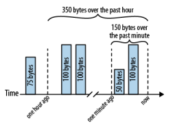

# The art of readable code

This repository contains the last chapter code example from the book "The art of readable code" by Dustin Boswell and Trevor Foucher written in Python.

Each directory contains a different example from the book.

## Problem

We need to keep track of how many bytes a web server has transferred over the past minute and over the past hour. Here’s an illustration of how these totals are maintained:

.

## Running the code

```bash
# to run naive solution
uv run python -i naive.py

# to run conveyor belt solution
uv run python -i conveyor_belt.py

# to run time bucket design solution
uv run -i time_bucket_design.py

```

```python
counter = MinuteHourCounter()
counter.add(10)
counter.add(10)
counter.add(10)

print(counter.minute_count()) # 30
print(counter.hour_count()) # 30
```

## Solution

| solution       | lines of code | cost per hour_count                | memory usage         | error in hour_count |
| -------------- | ------------- | ---------------------------------- | -------------------- | ------------------- |
| Naive solution | 49            | O(#events-per-hour) (~3.6 million) | unbounded            | 1 part per 3600     |
| Conveyor belt  | 73            | O(1)                               | O(#events-per-hour)¹ | 1 part per 3600     |
| Time-bucketed  | 99            | O(1)                               | O(#buckets)²         | 1 part per 60       |

¹ - In the original c++ code, ~5mb

² - In the original c++ code, ~500 bytes
