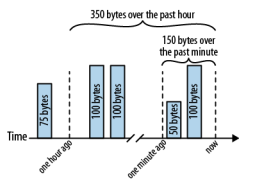

# The art of readable code

This repository contains the last chapter code example from the book "The art of readable code" by Dustin Boswell and Trevor Foucher written in Python.

Each directory contains a different example from the book.

## Problem

We need to keep track of how many bytes a web server has transferred over the past minute and over the past hour. Here’s an illustration of how these totals are maintained:

.

## Running the code

```bash
# to run naive solution
uv run naive.py
```
